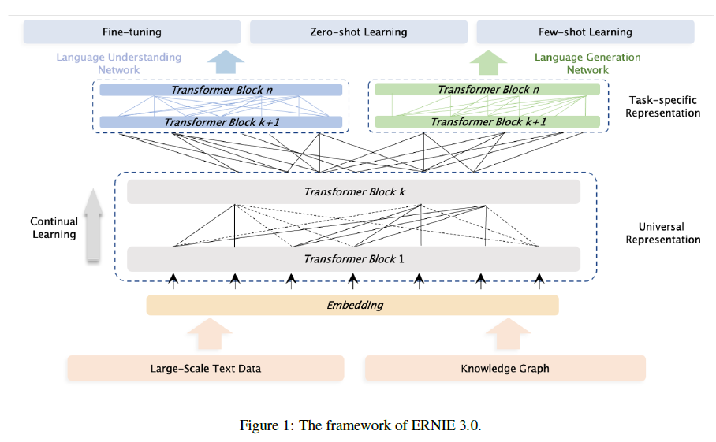

# language-generation

This is a NLP project for language generation. Research paper summary and possible implementation will be recorded.

## Concepts Integration

### Zero-shot learning

Zero-shot learning (ZSL) refers to the setting that the learner observes testing sample classes not existing in the 
training set. Zero-shot methods generally work by associating observed and non-observed classes through some form 
of auxiliary information, which encodes observable distinguishing properties of objects.

This problem is widely studied in computer vision, natural language processing, and machine perception.

## Paper Reading

### ERNIE 3.0:  LARGE-SCALE KNOWLEDGE ENHANCED PRE-TRAINING FOR LANGUAGE UNDERSTANDING AND GENERATION

- **Introduction**

This paper proposes a model for pre-training large-scale knowledge enhanced models. Though previous work such as T5 and 
GPT-3 achieves good generalization abilities using scaled pre-trained models, they did not introduce linguistic related
knowledge while training. Besides, the auto-regressively trained models may fail for downstream language understanding 
tasks. What presented in this paper is a unified framework that fuses both auto-regressive and auto-encoding networks, 
so that it can be easily tailored for both language understanding and generation tasks with zero-shot learning, few-shot 
learning or fine-tuning.

- **Related Work**

1. _Large-scale Pre-trained Models_

- Increase Model Size: lower perplexity and better performance (T5, GPT-3, etc.)
- Non-english large models: CPM with generative pretraining inspired by GPT-3, CPM-2, cross-modal pretraining M6, 
PangGu-alpha; Korean language model HyperCLOVA

2. _Knowledge Enhanced Models_

- Pretrained models: capture syntactical and semantic knowledge from large-scale corpus, lack world knowledge
- Typical form of world knowledge: knowledge graph, integrate entity and relation embedding from knowledge graph
(WKLM; KEPLER: knowledge embedding + mask language model objectives to align world knowledge and language representation
into the same semantic space; CoLAKE: integrated language and knowledge context in word-knowledge graph, jointly learned 
contextualized representation for language and knowledge with the extended mask language model objective)
- Extra annotation of large-scale data: ERNIE 1.0 with phrase masking and name entity masking to learn dependency info
in both local and global contexts; CALM to detect and revise a corrupted sentence with incorrect ordering of concepts,
detect truth sentence; K-Adapter utilized adapters trained on different knowledge sources with extra annotations

- **ERNIE 3.0**

(1) Pretrain model on massive unsupervised corpus including plain texts and knowledge graph.

(2) 12/24 layers of transformer for base/large model size

(3) Employ various types of pretraining tasks to enable the model to learn different levels of knowledge (valuable 
lexical, syntactic and semantic information; natural language understanding, natural language generation and knowledge 
extraction)

1. _Overview of Framework_

- Continual Multi-Paradigms Unified Pre-training Framework:
  - Assume that different task paradigms of NLP depend on identical underlying abstract features (lexical, syntactic);
  But their concrete features are incompatible (understanding task: semantic coherence, generation task: contextual info)
  - Compared with previous strategy employing a shared transformer network + self-attention masks to control the context
  - Multi-task learning: shared lower layers, top layers task specific
  - Exploits the continual multitask learning framework introduced in ERNIE 2.0

- Backbone shared network: Universal Representation Module
  - Universal semantic features extractor (e.g., multi-layer Transformer), shared parameter across tasks
  - MUlti-layer Transformer-XL (similar to XLNet, Segatron, ERNIE-Doc): 
  introduces an auxiliary recurrence memory module --> can model longer texts
  - Proverbially, the Transformer can capture the contextual information for each token in the sequence via 
  self-attention and generate a sequence of contextual embedding.
  - The larger the model, the stronger the capacity
  - the memory module only valid for natural language generation tasks while controlling the attention mask matrices (?)

- Task-specific networks: Task-specific Representation Modules
  - Extracts task-specific semantic features, parameter learnt separately
  - natural language understanding (NLU) and natural language generation (NLG)
  - multi-layer Transformer-XL, capture top-level semantic representations
  - base model size, not multi-layer perceptron or shallow Transformer: Stronger ability to capture semantic info, 
  perform task without significantly increase parameter number, realizable practical applications with less para-tuning

- Mitigate the dilemma: large-scale pre-trained models are difficult to implement with limited time and resources
  - Can update the parameter of task-specific network only during fine-tuning phase

2. _Pre-training Tasks_

